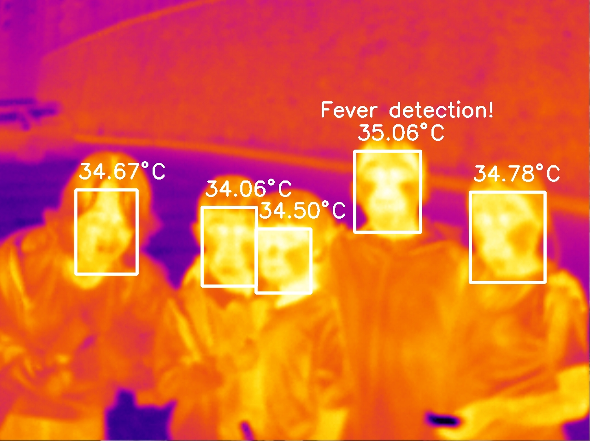
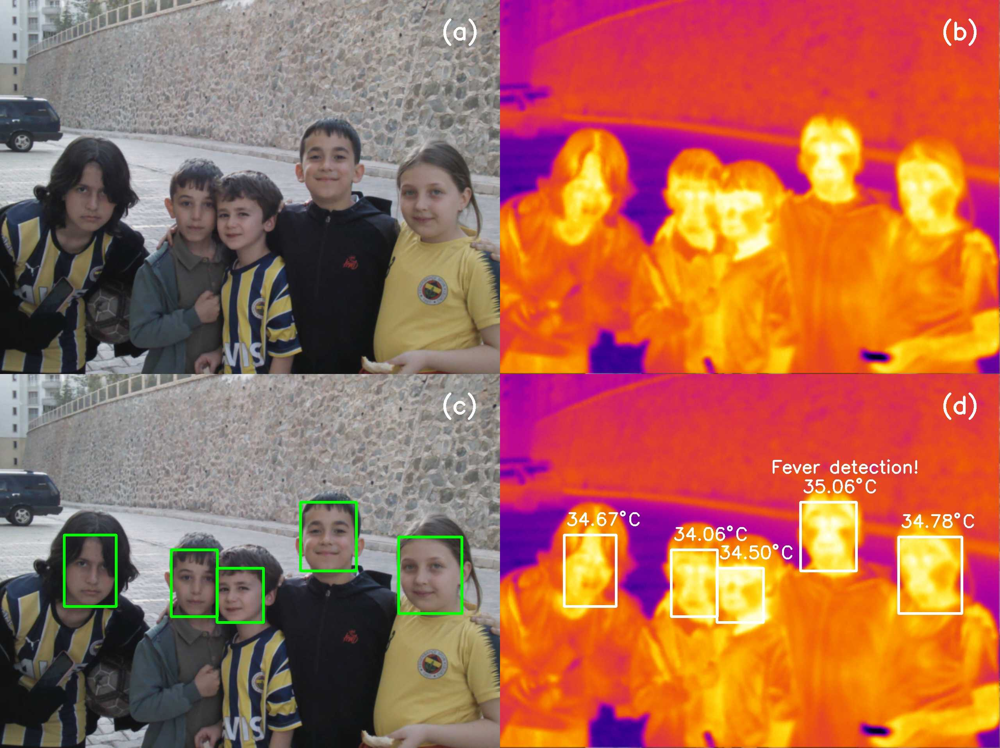

<h2>Fever Detection on Infrared Images</h2>

We visited face detection in OpenCV in a previously documented <a href="https://github.com/mtahakoroglu/OpenCV-face-detection" target="_blank">repo</a> with a <a href="https://www.youtube.com/watch?v=yf0bBCx3KGU" target="_blank">video link</a>. Now we try detecting images on infrared images with Haar Cascade and Deep Learning face detectors first. Subsequentially, due to low performance of HC and DL face detectors <b>on</b> infrared images, we followed the process depicted in Fig. 1 (a)-(b)-(c)-(d). Please click on the image below to view the video tutorial.

<ol>
    <li align="justify">https://pyimagesearch.com/2022/10/10/introduction-to-infrared-vision-near-vs-mid-far-infrared-images/</li>
    <li align="justify">https://pyimagesearch.com/2022/10/17/thermal-vision-measuring-your-first-temperature-from-an-image-with-python-and-opencv/</li>
    <li align="justify">https://pyimagesearch.com/2022/10/24/thermal-vision-fever-detector-with-python-and-opencv-starter-project/</li>
</ol>

<figure>
</a>
<figcaption align="justify">(a) Visible light (RGB) image. (b) Infrared Image. (c) DL based face detector results on visible light image. (d) Fever detection on infrared image by using detected faces in visible light image. As Fluke Thermal Imager provides temperature values of pixels directly, maximum temperature values in corresponding face regions are extracted and thresholded to achieve fever detection.</figcaption>
</figure>